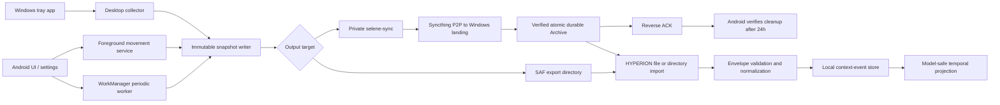
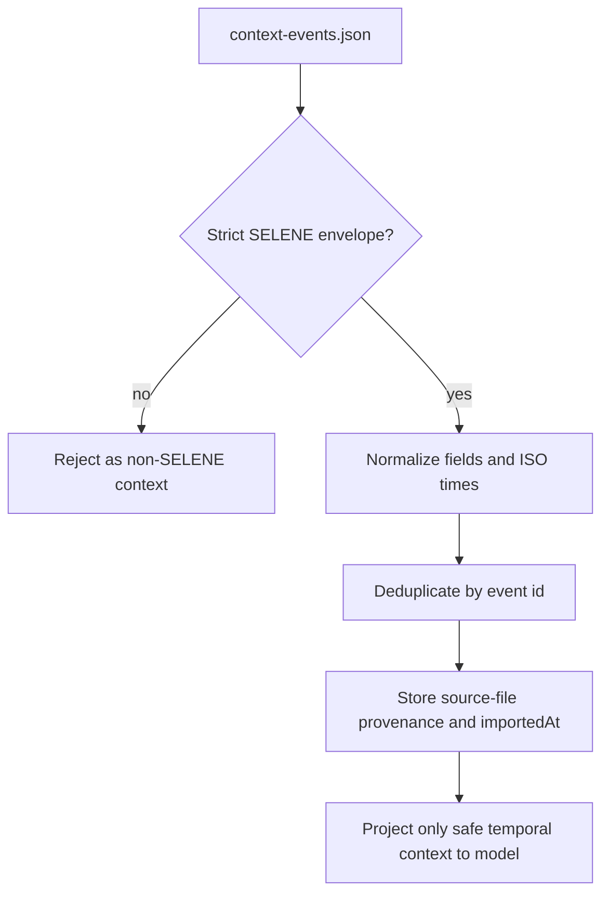

# SELENE Developer Guide

[English](DEVELOPER_GUIDE.md) | [简体中文](DEVELOPER_GUIDE.zh-CN.md)

This guide is for developers changing SELENE or its HYPERION hand-off. It
describes the `0.5.4` codebase, not an aspirational design. Read it before
adding a signal, changing movement detection, altering the export schema, or
publishing a release.

## 1. What SELENE Is

SELENE is a local, standalone timeline collector with two independent clients:

- Android collects selected phone context and optional continuous movement.
- Windows collects user-selected desktop activity, idle, power, and network
  state; sensitive window, path, and browser metadata is opt-in.

It is deliberately **not** a HYPERION plugin, a cloud service, or a database
manager. Each client writes new immutable files below a user-selected export
directory. HYPERION is a separate consumer that imports the files later.

The following invariants are more important than any individual collector:

1. A collector writes a new snapshot; it never reads, merges, overwrites, or
   deletes an earlier SELENE snapshot.
2. The selected export directory is the only cross-application data boundary.
   SELENE does not scan HYPERION files or private data belonging to another app.
3. Event time is the time the signal happened. Import time belongs to HYPERION.
4. Exact coordinates require explicit capture consent and are never projected
   to HYPERION's model input.
5. A schema change must remain readable by the deployed HYPERION importer, or it
   must use a new schema version.

## 2. Read This First

Read the documents in this order when joining the project:

1. This guide for ownership boundaries and change procedure.
2. [EXPORT_LAYOUT.md](EXPORT_LAYOUT.md) for the on-disk contract.
3. [ANDROID_MOVEMENT.md](ANDROID_MOVEMENT.md) or
   [WINDOWS_DESKTOP.md](WINDOWS_DESKTOP.md) for a platform-specific change.
4. [HYPERION SELENE event contract](https://github.com/bakahuiii/HYPERION/blob/main/docs/SELENE_EVENTS.md)
   before modifying events that HYPERION imports.
5. [RELEASE_PROCESS.md](RELEASE_PROCESS.md) before publishing binaries.
6. [P2P_SYNC.md](P2P_SYNC.md) and
   [THIRD_PARTY_NOTICES.md](../THIRD_PARTY_NOTICES.md) before changing remote sync.

## 3. Repository Map

| Area | Main files | Responsibility |
| --- | --- | --- |
| Android configuration | `app/src/main/.../MainActivity.kt`, `AutoCollectionSettings.kt` | Settings screen, Android permission sequence, collection gates, WorkManager schedule. |
| Android periodic collectors | `AutoContextWorker.kt`, `PlaceTagger.kt`, `OnlinePlaceEnricher.kt` | Hourly-ish non-continuous signals and a fresh-location fallback. |
| Android movement | `MovementTrackingService.kt`, `MovementSignalPolicy.kt` | Foreground location service, provider-aware filtering, movement state machine, batches, and summary event. |
| Android output | `ContextOutput.kt` | SAF or private sync-root writes, atomic publication, and local-offset timestamps. |
| Android P2P | `SyncthingService.kt`, `SyncthingClient.kt`, `PairingCode.kt`, `PairingManager.kt`, `SnapshotCleanup.kt` | Embedded-core lifecycle, loopback REST/CLI, pairing migration, ACK verification, and safe cleanup. |
| Windows UI | `desktop/SELENE.Windows/MainWindow.xaml.cs` | Tray-window lifecycle, timers, settings binding, capture feedback. |
| Windows capture | `Core/DesktopCollector.cs`, `ForegroundSessionTracker.cs`, `SystemSnapshotCollector.cs` | Signal collection, foreground session accounting, power/network/idle values. |
| Windows output | `Core/SeleneProtocol.cs` | Event records, compact JSON, unique immutable snapshot allocation. |
| Windows local state | `Core/SettingsStore.cs`, `AppLogger.cs`, `WindowsStartup.cs` | Settings, diagnostic log, optional current-user startup entry. |
| Windows P2P | `Core/SyncthingPairingService.cs`, `Core/SnapshotArchiveService.cs` | Syncthing preparation, live status, pinned enrollment, durable archive, and ACK emission. |
| Windows derived timeline | `Core/DailyMergedTimelineService.cs` | Rebuildable local-day combined JSON from Android and Windows immutable snapshots. |
| Windows local daily narrative | `Core/DailyNarrativeService.cs` | Deterministic local-rule Chinese JSON and Markdown reading view from the daily combined JSON. |
| Windows regression test | `desktop/SELENE.Windows.ContractTests/Program.cs` | Immutable-directory and byte-preservation contract check. |
| Release tooling | `tools/prepare-release.ps1` | Rebuild, test, package, validate, and checksum release artifacts. |
| HYPERION consumer | `HYPERION/src/lib/contextEvents.ts`, `HYPERION/src/lib/importer.ts` | Envelope validation, event normalization, deduplication, and model-safe projection. |

## 4. End-to-End Data Flow



Timeline content remains one-way from Android into Windows/HYPERION. The only
reverse flow is a hash ACK without event content; HYPERION never writes back to
SELENE. A duplicate file import is harmless only when event IDs are stable.

## 5. Shared Export Contract

### Snapshot envelope

Every successful write creates a new directory named using a UTC timestamp:

```text
<export root>/SELENE-v1-20260807T032000123Z/context-events.json
```

The directory timestamp is UTC so lexicographic ordering remains stable across
timezone changes. JSON timestamps use the operating system timezone and ISO
8601 offset, for example `2026-08-07T11:20:00.123+08:00` on this machine.

```json
{
  "schema": "selene-context-events/v1",
  "device": { "platform": "android" },
  "generatedAt": "2026-08-07T11:20:00.123+08:00",
  "producer": {
    "name": "SELENE",
    "version": "0.5.4",
    "layout": "immutable-snapshot-v1"
  },
  "events": []
}
```

HYPERION rejects the document unless its schema, `producer.name`, producer layout,
and event array match this contract. Do not use a generic JSON file as an
import shortcut.

Windows 0.5.4 additionally writes `Archive/Merged/SELENE-merged-v1-YYYY-MM-DD.json`.
This is derived data, not a new source of truth: it keeps the same
`selene-context-events/v1` envelope and `immutable-snapshot-v1` layout, preserves
every selected source event object, and adds `aggregation.schema: selene-daily-merge/v1`.
The merge reads both the durable Android archive and the selected Windows export
root, assigns events by the Windows-local date of `startAt`, and deduplicates by
stable event ID. A failed scan leaves the previous daily file unchanged.

### Event fields

| Field | Rule |
| --- | --- |
| `id` | Stable across a retry of the same observation. It is the deduplication key. Do not use a random UUID for ordinary periodic events. |
| `version` | Event-shape version. Current value is `1`. |
| `kind` | One of `calendar`, `location`, `movement`, `screen-time`, `activity`, `health`, `payment`, `device`, or `custom`. New kinds require a HYPERION change. |
| `source` | Current SELENE producers use `selene`. |
| `startAt`, `endAt` | ISO 8601. `endAt`, if present, must not be before `startAt`. |
| `title`, `summary` | Short human-readable text. Do not put raw private content here. |
| `values` | Scalar string, number, or boolean metadata. Preserve documented key names and keep it free of raw text, coordinates, addresses, window titles, and URLs. |
| `capturedAt` | When SELENE emitted the event. It can differ from `startAt`. |
| `importedAt` | Normally omitted by SELENE. HYPERION supplies actual import time; producers must not claim an import they did not perform. |
| `privacy` | `coarse` for normal context. Only precise `location` events with explicit consent may carry coordinates. |

### Identity and retry behavior

An immutable snapshot does not mean exactly-once delivery. A collector can be
retried, a batch can be flushed twice, and a user can import the same directory
more than once. Stable IDs make those cases idempotent in HYPERION.

- Android movement points use the confirmed `trackId` and sequence number.
- Android movement summaries use the same `trackId`.
- Windows `screen-time` and activity events describe observed intervals.
  Device, network, and collection-profile events use a per-capture token and
  describe the single capture instant, so concurrent same-millisecond captures
  cannot share an ID.

If an event's identity inputs change, it is a new event. Do not "fix" old
snapshots; write a new snapshot and let HYPERION retain provenance.

### Storage-size policy

SELENE controls size without lossy downsampling of exported information:

- JSON is compact UTF-8, not pretty printed.
- Android writes movement batches at 24 events or roughly 120 seconds instead
  of placing the same envelope around every point.
- Both platforms omit producer-side `importedAt`, which would otherwise repeat
  information HYPERION derives at import.
- Windows serializes one compact envelope per capture and reports its byte
  count to the UI and diagnostic log.

Do not remove fields, round a measurement more aggressively, or merge old
snapshots merely to make files smaller. Those are information-loss changes.

## 6. Android Architecture

### 6.1 Configuration and lifecycle

`MainActivity` owns user-facing setup. `syncMovementTracking()` starts the
movement service only when all of these are true:

1. Automatic collection is enabled.
2. The background-movement setting is enabled.
3. A SAF export tree URI is present, or Windows P2P pairing is complete.
4. Fine location is granted.
5. On Android 10+, background location is granted.

It also asks for Android 13+ notification permission so the foreground-service
state is visible. Notification permission is not location permission; the
service still needs the location grants above.

`AutoCollectionScheduler` owns WorkManager. It is for calendar, screen/app,
device, network, and fallback context, not for continuous travel. Stopping the
scheduler also stops the movement service.

`ContextOutput.writeEvents()` is synchronized because a periodic worker and
the service can write concurrently. Before pairing it uses SAF. After pairing
it writes under `filesDir/selene-sync`, fsyncs a temporary file, then atomically
renames it to `context-events.json`. Both modes create new snapshots only.

### 6.2 Periodic worker versus live movement

`AutoContextWorker` deliberately treats the last known location as a fallback:

- it accepts a location only when it is at most 30 minutes old;
- it emits `sampleMode: "last-known-fallback"` and
  `movementTracking: "foreground-service"`;
- it never starts or reconstructs a route.

This separation fixes the original failure mode: an hourly passive lookup can
miss an entire walk that begins and ends before the next worker execution.

### 6.3 Movement service state machine

`MovementTrackingService` requests GPS and network updates every 15 seconds
with an 8-metre provider distance hint. Those are request hints, not a promise:
Android and OEM power policy can delay, batch, or stop updates.

```mermaid
stateDiagram-v2
  [*] --> IDLE
  IDLE --> CANDIDATE: accepted point has start evidence
  CANDIDATE --> MOVING: two evidence samples within 90 seconds
  CANDIDATE --> IDLE: timeout or evidence expires
  MOVING --> MOVING: record accepted point
  MOVING --> IDLE: 90s stationary or 150s without movement evidence
  MOVING --> IDLE: service stops; summary and pending batch are flushed
```



The candidate buffer holds at most four accepted points. It is written only
after confirmation. This retains the beginning of a real walk but prevents a
few steps at home from becoming a standalone trip.

### 6.4 Acceptance and movement thresholds

An input point is rejected before it touches state when it is more than five
minutes stale, has no usable accuracy, exceeds 80 m accuracy, is out of time
order, or implies an implausible raw jump above 45 m/s after accuracy
allowance. A future-dated input is clamped to collection time before that order
check, rather than being silently lost.

`MovementSignalPolicy` maintains an independent anchor for each provider. GPS,
fused, and network are not interchangeable measurements: a provider handoff
has zero derived distance and cannot create evidence. For two samples from the
same provider, it subtracts accuracy overlap from great-circle distance. GPS or
fused inference requires both samples to be at most 50 m accurate; network
inference requires both to be at most 25 m accurate. Session-distance anchors
start fresh when a candidate becomes a confirmed track, making the first
exported point's distance exactly zero.

Speed is derived only from this resolved same-provider distance and elapsed
time. When Android also reports speed, SELENE averages reported and derived
speed only when they are within 8 m/s; otherwise it uses the derived value. A
reported speed counts as independent speed evidence only from GPS/fused with
location accuracy at most 35 m and, when supplied, speed accuracy at most
2.5 m/s.

| Purpose | Threshold |
| --- | --- |
| Start evidence | Trusted GPS/fused speed >= 0.8 m/s, or eligible same-provider resolved distance >= 15 m |
| Ongoing evidence | Trusted GPS/fused speed >= 0.65 m/s, or eligible same-provider resolved distance >= 10 m |
| Stationary evidence | Eligible same-provider speed <= 0.4 m/s and resolved distance <= 8 m |
| Confirmation | 2 start-evidence samples within 90 seconds |
| Candidate capacity | 4 points |
| Normal end | 90 seconds of stationary evidence |
| Unknown-data end | 150 seconds without movement evidence, checked every 30 seconds |
| Flush | 24 events or 120 seconds, plus start/end and destruction |

The two different start and ongoing thresholds are intentional hysteresis.
Never tune one in isolation: a lower start threshold may create indoor false
tracks, while a higher ongoing threshold may split slow walking into fragments.

### 6.5 Event production and failure behavior

While moving, each accepted point becomes a precise `location` event with:

- `trackId`, `sequence`, `moving: true`;
- speed in m/s and km/h;
- resolved distance from the preceding exported point of the same provider;
  the first point and a provider handoff have zero distance;
- accuracy, provider, and `sampleMode: "foreground-service"`;
- coordinates and an explicit `locationConsent` object with
  `captureMode: "foreground"`.

When the state ends, SELENE emits one coarse `movement` summary with duration,
distance, average and maximum speed, sample count, and the same `trackId`.

Writes are queued on one I/O executor. A transient SAF write error places the
batch back in memory for a later flush. This is not durable queueing: a process
kill before a successful write can lose the in-memory batch. Do not invent
points or extrapolate a route across that gap. On service destruction, SELENE
finishes any confirmed track, requests a force flush, and waits up to three
seconds for its executor.

### 6.6 Safe Android changes

For a new Android signal:

1. Decide whether it is periodic context or needs a live foreground service.
2. Check the Android permission, disclosure, and foreground-service policy.
3. Keep collection locally authorized and avoid raw content by design.
4. Build a stable event ID and use the v1 envelope fields.
5. Add the HYPERION parser/type/test change before emitting a new `kind`.
6. Verify on a physical device; emulator location and WorkManager timing are
   insufficient for movement behavior.

For a movement-threshold change, test at least: indoor steps, a 10-20 minute
walk, a short stop during a walk, stale and future-dated location delivery,
GPS/network handoffs, low-accuracy network fixes, permission revocation while
running, and disabling the feature during a confirmed track.

### 6.7 Embedded Syncthing and Android enrollment

`SyncthingPaths` is the single path authority. The executable comes from the
installed `applicationInfo.nativeLibraryDir`, identity/config lives under
`noBackupFilesDir/syncthing`, snapshots live under `filesDir/selene-sync`, and
reverse acknowledgements use `filesDir/selene-sync-acks`.
Never put a development-machine path, external storage path, or GUI API key in
code, a QR payload, logs, or events.

`SyncthingService` uses the `specialUse` foreground type. It uses the upstream
Android wrapper's validated `generate` and `serve --no-browser` commands,
sets the private home, no-upgrade policy, SQLite temporary directory, and
Android 14 gateway fallback through environment variables, and additionally
pins the GUI to loopback. Do not add CLI flags that have not been checked
against the bundled core. The service holds a Wi-Fi multicast lock and retries
unexpected exits. `BootReceiver` restores only saved pairing and enabled
collectors. The Android 8+ notification is a platform requirement and must not
be bypassed in the name of silence.

Initial identity generation and readiness probing each allow up to 120 seconds.
`SyncthingRuntimeStatus` records the phase, consecutive failures, exit code,
and sanitized log tail in private preferences. Missing files, unsupported ABIs,
and execute-permission failures are terminal and must end the wait immediately.
The pairing error dialog displays the complete cause; do not collapse these
states back into a generic timeout or a short toast.

`SyncthingClient` connects only to `127.0.0.1:8384` and parses the API key from
private XML with Android's pull parser. It rejects document type declarations
without relying on vendor-specific `DocumentBuilderFactory` feature URIs, then
caches the key for the client lifetime. Pairing adds Windows, creates or
validates the data Send Only and ACK Receive Only folders, then adds their
remote folder members. Never expose the REST endpoint to the LAN.

`PairingCode.decode()` keeps fixed schema/folder, device-ID, expiry, 64-hex
certificate SHA-256, and private/link-local HTTPS `/enroll` checks. Hostnames
and public addresses remain forbidden against QR-driven SSRF. A self-signed
leaf is trusted only when its digest exactly matches the QR pin.

Android configures locally before returning its ID. Paired state is persisted
only after a 2xx response; token and endpoints are never persisted. Disconnect
may remove remote config and paired state, but never snapshots or phone identity.

### 6.8 ACK migration and safe Android cleanup

`SyncthingService` owns a housekeeping thread in addition to the core thread.
After readiness it always calls idempotent `configure()` with the Windows device
ID already stored in SharedPreferences. An in-place update therefore adds
`selene-ack-v1` without a new QR field or identity change. It then invokes
`SnapshotCleanup.clean()` every 15 minutes.

The cleanup trust boundary is a Windows `selene-archive-ack/v1`, not online
state or Syncthing completion. It parses UTC capture time from the immutable
directory name, requires at least 24 hours, then compares the ACK to a recursive
local manifest: exact file set, normalized relative paths, per-file byte count
and SHA-256, total bytes, and `context-events.json` hash. Any parse failure,
missing or extra file, symlink, or hash mismatch retains the complete directory.
Only after full validation is the directory atomically renamed out of the
Syncthing root into a same-filesystem private cleanup quarantine and recursively
deleted. A failed quarantine cleanup is retried on the next housekeeping run.

`SnapshotCleanupRuntimeStatus` stores only total deletions, last-run time, and
the first error, never event content or manifests. A retention or ACK schema
change extends `SnapshotCleanupTest` for valid old deletion, valid young
retention, missing ACK, hash mismatch, and malformed ACK. Never add an
"online plus 100% completion" deletion shortcut.

## 7. Windows Architecture

### 7.1 Application lifecycle

The WPF process is a visible tray application, not a Windows service. Closing
the main window hides it; the tray Exit command performs a real shutdown.
Collection exists only while this process is alive. Optional startup writes a
current-user Run entry only for a published executable, never for a debug run.

`MainWindow` runs three independent timers:

- every 10 seconds, `ForegroundSessionTracker.Observe()` samples the current
  foreground executable and only the selected optional metadata;
- at 5, 15, 30, or 60 minute intervals, `DesktopCollector.CaptureAsync()`
  creates a snapshot when automatic collection and a valid output folder are
  enabled.
- every 10 seconds, `SyncthingPairingService.MaintainAsync()` archives new
  snapshots and refreshes connection state.

Automatic collection also performs one immediate capture when the application
initializes with a valid folder.

### 7.2 Collection and consistency

`DesktopCollector` serializes captures with `SemaphoreSlim`. It cuts completed
foreground sessions, builds selected screen-time/activity/device/network events,
and writes them through `ImmutableSnapshotWriter`.

The ordering matters:

1. `ForegroundSessionTracker.CutAndDrain()` closes the active session at the
   capture boundary and returns completed segments.
2. The writer creates a new directory, opens JSON with `FileMode.CreateNew`,
   writes compact JSON, and flushes it to disk.
3. Only after success does `DesktopCollector` advance `previousCaptureAt`.
4. If writing fails, `Restore()` requeues the drained sessions in time order;
   the next capture can include them again.

Pending sessions are checkpointed under `%LOCALAPPDATA%\SELENE` and removed
only after acknowledgement. This prevents a failed write from silently losing
foreground-session history, but cannot protect the still-active interval from a
sudden process termination or power failure.
Sessions shorter than five seconds are omitted as individual `activity` events
but remain represented in the aggregate `screen-time` event.

### 7.3 Windows event set

| Event | Values | Notes |
| --- | --- | --- |
| `screen-time` | `foregroundSeconds`, `activeAppCount`, `windowSeconds` | One aggregate for the capture window. |
| `activity` | `application`, `durationSeconds`, `detail`; optional `windowTitle`, `executablePath`, `browserUrl` | Optional fields require explicit settings and are `privacy: "sensitive"`. Browser URL is address-bar best effort only. |
| `collection-profile` | six enabled/disabled field groups | Every snapshot records the choices used to produce it. |
| `device` | idle, power, battery values | Current state, not an activity history. |
| `device` | network availability and coarse transport | A separate network snapshot, also `kind: "device"`. |

`ImmutableSnapshotWriter` probes millisecond suffixes if a directory already
exists, up to 1,000 attempts. It writes and flushes `context-events.json.tmp`,
then atomically renames it to `context-events.json`; a failed write removes an
otherwise empty allocated directory. This protects immutable output when two
writes use the same clock time and prevents an importer seeing a half-written
document. JSON is compact and uses the system's local offset; directory names
remain UTC.

Settings use `desktop-settings.json` under the SELENE data root and are written
via a temporary file followed by replace. Set `SELENE_DATA_ROOT` to relocate
the root; otherwise it falls back to `%LOCALAPPDATA%\SELENE`. The root contains
`WindowsExport`, `Inbox`, `Archive`, `SyncAcknowledgements`, `logs`, and the
foreground-session checkpoint. Neither settings nor diagnostics are an
exported timeline or a HYPERION input.

### 7.4 Safe Windows changes

When adding a Windows signal, make it a separate explicit setting, default it
off if it can contain private text, and include it in `collection-profile`.
Keep browser support limited to metadata exposed through the current foreground
window; do not add page-body, form, key, clipboard, notification, chat, or
credential capture. Update `DesktopCollector`, keep capture serialization, add
a stable ID, then extend `desktop/SELENE.Windows.ContractTests` if immutable
output behavior or serialization changes. Do not make the collector a service
without revisiting privacy disclosure, session isolation, and installer design.

### 7.5 Windows enrollment endpoint

`SyncthingPairingService` belongs to SELENE Windows, not HYPERION. It resolves the
core through `SELENE_SYNCTHING_PATH`, PATH, and the winget package directory;
installation occurs only after explicit code generation. It reuses an existing
`selene-inbox-v1` and enforces Receive Only. It also creates the
`selene-ack-v1` Send Only directory and a separate durable Archive under
current-user app data. User-level `HYPERION_SELENE_INBOX` points to Archive, not
the landing folder that receives Android deletions. All paths come from runtime
APIs.

`MainWindow` runs pairing preparation and QRCoder encoding on background tasks.
The service caches the validated Syncthing path, device ID, and the last five
minutes of inbox preparation for the current process. `UserEnvironment` first
compares the user value and writes HKCU `Environment` only when the path changes;
`WM_SETTINGCHANGE` is a bounded background broadcast. Do not restore an
unconditional `Environment.SetEnvironmentVariable(..., User)` call: one hung
top-level window can make that synchronous broadcast take many seconds and
freeze the WPF UI.

An offer binds an ephemeral port, enumerates private IPv4 endpoints, creates a
short-lived RSA certificate and 256-bit token, and renders locally with QRCoder.
The TLS server accepts private-source `POST /enroll` up to 32 KiB. Only after
schema, folder, device-ID, and constant-time token checks does it add Android
through the local CLI. Success closes it immediately; five-minute cancellation
is a hard limit.

Every Windows startup performs an idempotent migration: it reads the remote
members of `selene-inbox-v1` and adds the same members to `selene-ack-v1`. New
enrollment shares both folders as well, so an old pairing needs no new QR.

`SnapshotArchiveService` accepts only strict snapshot names and
`selene-context-events/v1` envelopes. It builds an ordered all-file manifest,
copies into a random Archive-side `.tmp` directory with WriteThrough and
`Flush(true)`, compares the pre-copy manifest, destination manifest, and
post-copy source manifest, then atomically publishes with `Directory.Move`.
An existing same-name Archive must match completely. Invalid JSON, conflicts,
temporary files, reparse points, and I/O failures produce no ACK. ACK files use
their own flushed temporary-file rename. Contract tests cover atomic publish,
idempotency, conflict blocking, and no ACK for invalid JSON.

Live connection status combines `syncthing cli show connections` with the data
folder member list. The UI distinguishes `isLocal` LAN links from remote/relay
links, but never treats connectivity or transfer completion as archive proof.

Windows Firewall is external enrollment state and must not be bypassed. Manual
tests cover Private-network allow, Public-network deny, multi-adapter fallback,
expiry, wrong token, duplicates, an existing folder path, and completion while
the main window is hidden.

## 8. HYPERION Import and Privacy Boundary

HYPERION owns validation and import semantics. SELENE must not assume a file is
accepted merely because it is valid JSON.



`HYPERION/src/lib/contextEvents.ts` applies the following rules:

- unknown `kind` values become `custom`; unknown sources are rejected;
- invalid ISO dates, invalid end ordering, and malformed envelope metadata are
  rejected or normalized away;
- only scalar `values` entries with valid keys are retained;
- exact coordinate data is retained locally only for `kind: "location"`,
  `privacy: "precise"`, and valid explicit consent;
- model projection removes coordinates, address-like value keys, and consent
  information. For location it exposes only a coarse location title and an
  optional `placeTag`.

The `movement` summary is intentionally a separate kind. It reaches HYPERION as
`movement`, rather than being silently downgraded to `custom`. Any new SELENE
kind must be added to HYPERION's `ContextEventKind`, accepted-kind set, docs, and
tests before release.

## 9. Build, Test, and Manual Verification

Run commands from the SELENE repository root.

### Android

```powershell
$env:JAVA_HOME = '<JDK_17_HOME>'
$env:ANDROID_HOME = '<ANDROID_SDK_HOME>'
gradle --no-daemon :app:testDebugUnitTest :app:lintDebug :app:assembleDebug
```

The APK is `app\build\outputs\apk\debug\app-debug.apk`. Address new lint
errors; existing Android framework deprecation warnings must not be hidden by
blanket suppression.

### Windows

```powershell
dotnet build desktop\SELENE.Windows\SELENE.Windows.csproj -c Release
dotnet run --project desktop\SELENE.Windows.ContractTests\SELENE.Windows.ContractTests.csproj -c Release
```

The contract test covers immutable snapshots, atomic durable archive, ACK
idempotency and conflict blocking, existing-device ACK migration, and
online/offline plus LAN/remote connection summaries.

### HYPERION compatibility

Run this in the HYPERION repository after changing the common contract:

```powershell
npm run test:context-events
```

Also import a real exported parent directory in HYPERION. Confirm the movement
summary remains `movement`, duplicate import does not increase event count, and
coordinates are absent from the model-facing context.

### Physical-device checklist

1. Use a new export directory and grant only the intended permissions.
2. Confirm the foreground notification appears only after all movement gates
   are met.
3. Walk long enough to create two accurate movement-evidence samples.
4. Inspect JSON: local-offset timestamps, UTC directory name, shared `trackId`,
   point sequence, and one final summary.
5. Walk a few indoor steps and confirm no standalone movement track appears.
6. Disable background location or automatic collection during a track and
   confirm the confirmed portion is finalized without rewriting old files.

## 10. Change and Release Checklist

Before merging a behavioral change, answer all of these:

1. Which platform owns the signal, and why is that platform authorized to read
   it?
2. Is it periodic state, a foreground session, or continuous movement?
3. What makes its ID stable over retries?
4. Which fields are source time, capture time, and import time?
5. Could any text, coordinate, address, title, URL, or credential cross the
   export or model boundary?
6. Does HYPERION already understand the kind and all required metadata?
7. What happens on permission revocation, process death, a full disk, or a
   failed SAF write?
8. Which automated and physical-device tests prove the expected behavior?

For a binary release, use:

```powershell
$env:JAVA_HOME = '<jdk-home>'
.\tools\prepare-release.ps1 -Version <version>
```

The script refuses to overwrite an existing `releases\v<version>` staging
directory. It runs Android unit tests/lint/build, Windows build and contract test,
self-contained Windows publish, APK manifest/alignment/signature verification,
ZIP inventory checking, and SHA-256 generation. Follow
[RELEASE_PROCESS.md](RELEASE_PROCESS.md) for the tag, GitHub attachment, and
downloaded-asset checksum steps. The Android artifact is intentionally named
`android-debug.apk` until a separately managed release-signing key exists.

## 11. Reference Links

- [One-time P2P pairing](P2P_SYNC.md)
- [Android movement details](ANDROID_MOVEMENT.md)
- [Windows collector details](WINDOWS_DESKTOP.md)
- [Export layout](EXPORT_LAYOUT.md)
- [Release process](RELEASE_PROCESS.md)
- [HYPERION event contract](https://github.com/bakahuiii/HYPERION/blob/main/docs/SELENE_EVENTS.md)
- [HYPERION importer source](https://github.com/bakahuiii/HYPERION/blob/main/src/lib/contextEvents.ts)
