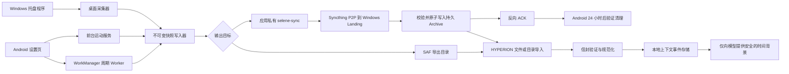
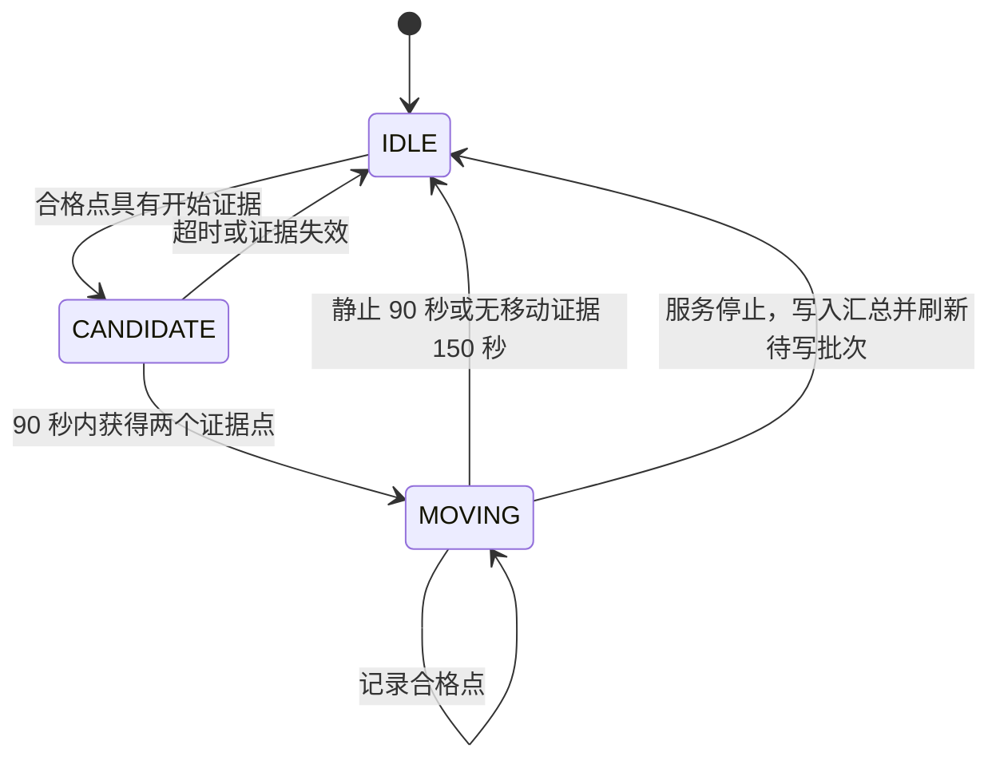
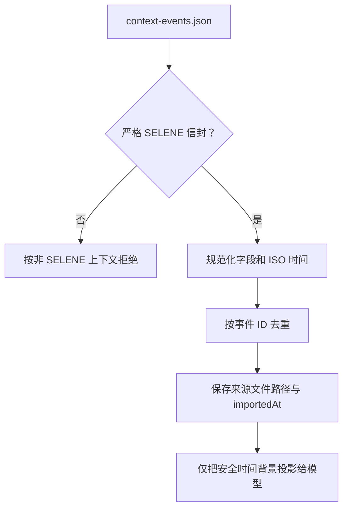

# SELENE 开发者指南

[English](DEVELOPER_GUIDE.md) | [简体中文](DEVELOPER_GUIDE.zh-CN.md)

本文面向需要修改 SELENE 或 HYPERION 对接逻辑的开发者，依据当前 `0.5.4`
实现编写，不是未来规划。修改采集源、运动判定、导出协议或发布版本前，应先读完本文。

## 1. SELENE 的定位

SELENE 是一个本地时间线采集器，有两个彼此独立的客户端：

- Android：采集经授权的手机上下文，并可选地持续记录已确认的移动。
- Windows：采集由用户选择的桌面活动、空闲、电源和网络状态；窗口、路径和浏览器
  元数据属于默认关闭的敏感选项。

它不是 HYPERION 插件、云服务或数据库管理器。两个客户端都只会在用户选择的导出目录下写入新的不可变文件；HYPERION 在之后作为独立消费者导入这些文件。

以下约束高于任何一个具体采集功能：

1. 采集器只创建新快照，绝不读取、合并、覆盖或删除旧的 SELENE 快照。
2. 用户选择的导出目录是唯一跨应用数据边界。SELENE 不扫描 HYPERION 文件，也不读取其他应用的私有数据。
3. 事件时间表示信号发生时间；导入时间属于 HYPERION。
4. 精确坐标必须有明确的采集同意记录，且绝不能进入 HYPERION 的模型输入。
5. 协议改动必须保持已部署 HYPERION 导入器可读；否则应创建新的 schema 版本。

## 2. 推荐阅读顺序

继续开发前，建议按下面顺序阅读：

1. 本文：理解所有权边界与改动流程。
2. [EXPORT_LAYOUT.zh-CN.md](EXPORT_LAYOUT.zh-CN.md)：理解磁盘协议。
3. 按平台阅读 [ANDROID_MOVEMENT.zh-CN.md](ANDROID_MOVEMENT.zh-CN.md) 或
   [WINDOWS_DESKTOP.zh-CN.md](WINDOWS_DESKTOP.zh-CN.md)。
4. 修改 HYPERION 要导入的事件前，先看
   [HYPERION SELENE 事件协议](https://github.com/bakahuiii/HYPERION/blob/main/docs/SELENE_EVENTS.zh-CN.md)。
5. 发布二进制前看 [RELEASE_PROCESS.zh-CN.md](RELEASE_PROCESS.zh-CN.md)。
6. 修改远程同步前完整阅读 [P2P_SYNC.zh-CN.md](P2P_SYNC.zh-CN.md) 和
   [THIRD_PARTY_NOTICES.md](../THIRD_PARTY_NOTICES.md)。

## 3. 仓库地图

| 区域 | 主要文件 | 职责 |
| --- | --- | --- |
| Android 配置 | `app/src/main/.../MainActivity.kt`、`AutoCollectionSettings.kt` | 设置页、权限流程、采集开关、WorkManager 调度。 |
| Android 周期采集 | `AutoContextWorker.kt`、`PlaceTagger.kt`、`OnlinePlaceEnricher.kt` | 非连续信号和最近位置兜底。 |
| Android 运动 | `MovementTrackingService.kt`、`MovementSignalPolicy.kt` | 前台定位服务、按提供方过滤、状态机、事件批量写入和行程汇总。 |
| Android 输出 | `ContextOutput.kt` | SAF 或应用私有同步目录写入、原子发布和本地时区时间。 |
| Android P2P | `SyncthingService.kt`、`SyncthingClient.kt`、`PairingCode.kt`、`PairingManager.kt`、`SnapshotCleanup.kt` | 内置核心生命周期、loopback REST/CLI、配对迁移、ACK 验证和安全清理。 |
| Windows UI | `desktop/SELENE.Windows/MainWindow.xaml.cs` | 托盘窗口生命周期、定时器、设置绑定、采集反馈。 |
| Windows 采集 | `Core/DesktopCollector.cs`、`ForegroundSessionTracker.cs`、`SystemSnapshotCollector.cs` | 信号采集、前台会话统计、电源/网络/空闲状态。 |
| Windows 输出 | `Core/SeleneProtocol.cs` | 事件记录、紧凑 JSON、不可变快照目录分配。 |
| Windows 本地状态 | `Core/SettingsStore.cs`、`AppLogger.cs`、`WindowsStartup.cs` | 设置、诊断日志、可选的当前用户开机启动。 |
| Windows P2P | `Core/SyncthingPairingService.cs`、`Core/SnapshotArchiveService.cs` | Syncthing 准备、连接状态、证书固定 enrollment、持久归档和 ACK。 |
| Windows 派生时间线 | `Core/DailyMergedTimelineService.cs` | 从 Android 与 Windows 不可变快照重建按日双端合并 JSON。 |
| Windows 本地日摘要 | `Core/DailyNarrativeService.cs` | 将按日合并 JSON 以确定性本地规则整理成可读中文 JSON 与 Markdown。 |
| Windows 回归测试 | `desktop/SELENE.Windows.ContractTests/Program.cs` | 验证目录不可变性和已有 JSON 字节不变。 |
| 发布工具 | `tools/prepare-release.ps1` | 重新构建、测试、打包、验证和生成校验和。 |
| HYPERION 消费端 | `HYPERION/src/lib/contextEvents.ts`、`HYPERION/src/lib/importer.ts` | 信封验证、事件规范化、去重和模型安全投影。 |

## 4. 端到端数据流



时间线内容流仍是 Android 到 Windows/HYPERION 单向；反向只传不含事件正文的哈希 ACK，
HYPERION 不回写 SELENE。用户重复导入同一目录不会产生重复事件的前提是事件 ID 稳定。

## 5. 共用导出协议

### 快照信封

每次写入都会新建一个以 UTC 时间命名的目录：

```text
<导出根目录>/SELENE-v1-20260807T032000123Z/context-events.json
```

目录时间始终使用 UTC，因此跨时区后字典序仍稳定。JSON 内部时间使用操作系统时区和 ISO 8601 偏移；本机为 `+08:00`，例如 `2026-08-07T11:20:00.123+08:00`。

```json
{
  "schema": "selene-context-events/v1",
  "device": { "platform": "android" },
  "generatedAt": "2026-08-07T11:20:00.123+08:00",
  "producer": {
    "name": "SELENE",
    "version": "0.5.4",
    "layout": "immutable-snapshot-v1"
  },
  "events": []
}
```

HYPERION 会同时检查 schema、`producer.name`、producer layout 和事件数组。普通 JSON 文件不能借此协议被当作 SELENE 数据导入。

Windows `0.5.4` 另外写入 `Archive/Merged/SELENE-merged-v1-YYYY-MM-DD.json`。它是派生数据，
不是新的事实来源；仍使用 `selene-context-events/v1` 和
`immutable-snapshot-v1`，保留选中来源事件的完整 JSON，并增加
`aggregation.schema: selene-daily-merge/v1`。合并读取 Android 持久归档和 Windows 导出根目录，
按 Windows 系统时区的 `startAt` 日期归档，按稳定事件 ID 去重。扫描失败时上一份健康日文件保持不变。

### 事件字段

| 字段 | 规则 |
| --- | --- |
| `id` | 同一次观测重试时必须稳定，是去重键。普通周期事件不能使用随机 UUID。 |
| `version` | 事件结构版本，当前为 `1`。 |
| `kind` | `calendar`、`location`、`movement`、`screen-time`、`activity`、`health`、`payment`、`device` 或 `custom`。新增 kind 必须同步修改 HYPERION。 |
| `source` | 当前 SELENE 生产端使用 `selene`。 |
| `startAt`、`endAt` | ISO 8601；存在 `endAt` 时不得早于 `startAt`。 |
| `title`、`summary` | 简短、可读，不能放入原始隐私文本。 |
| `values` | 只允许 string/number/boolean 元数据。保留已文档化的 key，禁止放原始文本、坐标、地址、窗口标题、URL。 |
| `capturedAt` | SELENE 生成事件的时间，可以不同于 `startAt`。 |
| `importedAt` | SELENE 通常省略；HYPERION 在实际导入时补入，生产端不得伪造导入时间。 |
| `privacy` | 普通上下文为 `coarse`。只有带明确同意记录的 precise `location` 才可带坐标。 |

### ID 与重试

不可变快照不等于恰好一次投递：采集器可能重试，批次可能被重复写入，用户也可能反复导入同一目录。稳定 ID 使 HYPERION 的处理具备幂等性。

- Android 运动点使用已确认的 `trackId` 与序号。
- Android 运动汇总使用同一个 `trackId`。
- Windows 的 `screen-time` 与活动事件表示已观测区间。设备、网络和采集配置事件使用每次采集的 token，只表示该采集瞬间，因此同一毫秒的并发采集也不会复用 ID。

一旦 ID 的组成输入改变，那就是新事件。不要修补旧快照；应写入新快照，由 HYPERION 保留来源路径。

### 文件大小策略

SELENE 通过编码和批量策略控制大小，而不丢失已记录信息：

- JSON 使用紧凑 UTF-8，不缩进。
- Android 每 24 个运动事件或约 120 秒写一次批，避免每个点重复一次完整信封。
- 两个平台都不写生产端 `importedAt`，避免重复 HYPERION 导入时才知道的信息。
- Windows 使用紧凑信封，并把写入字节数显示到 UI 和日志。

不要为减小文件而删字段、过度取整或合并旧快照，这些都是信息损失型修改。

## 6. Android 架构

### 6.1 配置与生命周期

`MainActivity` 负责用户设置。只有同时满足下面条件时，`syncMovementTracking()` 才会启动运动服务：

1. 已开启自动采集。
2. 已开启后台运动记录设置。
3. 已通过 SAF 选择导出树 URI，或已完成 Windows P2P 配对。
4. 已授予精确位置。
5. Android 10+ 已授予后台位置。

Android 13+ 还会请求通知权限，使前台服务状态可见。通知权限不是位置权限，运动服务仍需要前述位置授权。

`AutoCollectionScheduler` 负责 WorkManager。它用于日历、屏幕/应用、设备、网络和位置兜底，不用于持续移动。停止调度器也会停止运动服务。

`ContextOutput.writeEvents()` 使用同步锁，因为周期 Worker 和运动服务可能并发写入。
未配对时它沿用 SAF；配对后写入 `filesDir/selene-sync`，先写临时文件、调用
`fsync`，再原子改名为 `context-events.json`。两种模式都只创建新快照。

### 6.2 周期 Worker 与实时移动的分工

`AutoContextWorker` 明确把最后已知位置当作兜底：

- 位置超过 30 分钟即丢弃；
- 事件标记 `sampleMode: "last-known-fallback"` 和
  `movementTracking: "foreground-service"`；
- 它绝不启动、推测或重建路线。

这样解决了原先的问题：每小时一次的被动查询可能完全错过两次执行之间开始又结束的一段散步。

### 6.3 运动服务状态机

`MovementTrackingService` 向 GPS 与 network provider 请求每 15 秒一次、8 米距离提示的更新。这只是请求提示，Android 与厂商省电策略仍可能延迟、合批或停止更新。



候选缓冲最多保留 4 个已接受点，只有确认后才导出。这样能保留真实散步开端，又不会把家里走几步记成独立行程。

### 6.4 接受与判定阈值

点进入状态机前会被丢弃，如果它早于当前五分钟、没有可用精度、精度大于 80 米、时间倒退，或在精度容差后仍推导出超过 45 m/s 的原始距离跳点。意外落在未来的时间戳会先钳制为当前采集时间，再做顺序检查，不会被悄悄丢掉。

`MovementSignalPolicy` 为每个提供方维护独立锚点。GPS、fused 与 network 不是可以互换的测量流：切换提供方的推导距离恒为零，不能产生移动证据。对于同一提供方的两个样本，它会从大圆距离中扣除定位精度可重叠范围。GPS/fused 推导要求两点精度均不超过 50 米；network 推导要求两点精度均不超过 25 米。候选行程确认后会重新建立路线距离锚点，因此第一个导出点的距离严格为零。

必要时速度仅由这种“已扣除不确定度的同一提供方距离”与时间差推导。Android 同时提供 speed 时，仅在它与推导速度相差不超过 8 m/s 时取平均，否则采用推导速度。报告速度只有来自 GPS/fused、位置精度不超过 35 米且（若系统给出）速度精度不超过 2.5 m/s 时才可单独作为速度证据。

| 用途 | 阈值 |
| --- | --- |
| 开始证据 | 可信 GPS/fused 速度 >= 0.8 m/s，或合格同一提供方的已扣除不确定度距离 >= 15 m |
| 持续证据 | 可信 GPS/fused 速度 >= 0.65 m/s，或合格同一提供方的已扣除不确定度距离 >= 10 m |
| 静止证据 | 合格同一提供方速度 <= 0.4 m/s 且已扣除不确定度距离 <= 8 m |
| 确认 | 90 秒内 2 个开始证据点 |
| 候选容量 | 4 个点 |
| 正常结束 | 连续静止证据 90 秒 |
| 未知数据结束 | 连续 150 秒没有移动证据，每 30 秒检查一次 |
| 刷新 | 24 事件或 120 秒，以及开始/结束/销毁时 |

开始与持续阈值不同是刻意的滞回设计。不要只改其中一个：降低开始阈值可能让室内产生误报，提高持续阈值可能把慢走切成多段。

### 6.5 事件产生与失败语义

移动状态中，每个合格点生成一个 precise `location` 事件，包含：

- `trackId`、`sequence`、`moving: true`；
- m/s 与 km/h 速度；
- 到同一提供方上一个已导出点的已扣除不确定度距离；第一个点和提供方切换均为零；
- 精度、provider、`sampleMode: "foreground-service"`；
- 坐标及 `captureMode: "foreground"` 的明确 `locationConsent`。

状态结束时，SELENE 生成一个 coarse `movement` 汇总事件，包含时长、距离、平均/最大速度、样本数和相同的 `trackId`。

写入通过单个 I/O executor 排队。临时 SAF 写入错误会把批次放回内存，等待之后刷新；但它不是持久队列，进程在成功写入前被杀死仍可能丢失内存中的批次。绝不能跨越这个空缺伪造点或补全路线。服务销毁时会结束已确认行程、请求强制刷新，并最多等待 executor 3 秒。

### 6.6 Android 的安全改动步骤

新增 Android 信号时：

1. 先判断它是周期上下文，还是必须由实时前台服务采集。
2. 检查 Android 权限、披露与前台服务政策。
3. 从设计上确保采集仅在本地且经授权，避免原始内容。
4. 设计稳定事件 ID，使用 v1 信封字段。
5. 新增 `kind` 前，先完成 HYPERION 类型、解析、文档和测试改动。
6. 必须在真机验证；模拟器定位和 WorkManager 时序不能证明运动逻辑正确。

修改运动阈值至少应测试：室内走几步、10-20 分钟步行、步行中的短暂停留、过期与未来时间的位置、GPS/network 切换、低精度网络定位、运行时撤销权限，以及行程中关闭功能。

### 6.7 内置 Syncthing 与 Android enrollment

`SyncthingPaths` 是所有私有路径的唯一来源：核心来自安装后的
`applicationInfo.nativeLibraryDir`，身份/配置在 `noBackupFilesDir/syncthing`，快照在
`filesDir/selene-sync`，反向确认在 `filesDir/selene-sync-acks`。禁止把开发机路径、外部共享存储路径或 GUI API key 写入代码、
二维码、日志或事件。

`SyncthingService` 使用 `specialUse` 前台服务类型。它用与上游 Android wrapper 一致的
`generate` 和 `serve --no-browser` 主命令，通过环境变量设置应用私有 home、禁止升级、
SQLite 临时目录和 Android 14 网关兜底，并额外把 GUI 固定到 loopback。不要随意添加
未经当前内置核心验证的 CLI flag。服务持有 Wi-Fi multicast lock，并在非主动停止的
退出后重试。`BootReceiver` 只恢复已保存配对和已启用采集。Android 8+ 的前台通知是
系统约束，不能以“静默”为由规避。

首次身份生成和就绪探测最长各允许 120 秒。`SyncthingRuntimeStatus` 在私有 preferences
中记录阶段、连续失败数、退出码和脱敏日志尾部；文件缺失、ABI 不支持和执行权限错误
属于 terminal failure，应立即结束等待。配对失败用对话框显示完整原因，不能退化成
统一“启动超时”或只在短 Toast 中显示。

`SyncthingClient` 只连接 `127.0.0.1:8384`，API key 从私有 `config.xml` 用 Android
pull parser 读取。解析器直接拒绝文档类型声明，不依赖各厂商支持不一致的
`DocumentBuilderFactory` feature URI，并在 client 生命周期内缓存 key。配对通过本机
CLI/REST 先加入 Windows，再创建或校验数据 Send Only、ACK Receive Only 两个文件夹和
远端 folder member。不得把 REST 端口暴露给 LAN。

`PairingCode.decode()` 必须继续校验固定 schema/folder、标准设备 ID、有效期、64 位
十六进制证书 SHA-256，以及仅私有/链路本地 IP 的 HTTPS `/enroll`。禁止域名和公网
地址以阻止二维码驱动的 SSRF。自签名证书只有在叶证书指纹完全匹配二维码时才可信。

Android 先配置本机核心，再回传自己的 ID。只有 Windows 返回 2xx 后才持久化 paired
标志；令牌和 endpoint 不持久化。解除配对可删除远端配置和标志，但不能删除快照或
手机 Syncthing 身份。

### 6.8 ACK 迁移与 Android 安全清理

`SyncthingService` 除核心线程外还有 housekeeping 线程。核心就绪后，它总是使用
SharedPreferences 已保存的 Windows 设备 ID 调用幂等 `configure()`，所以从旧版本覆盖
更新会自动补建 `selene-ack-v1`，不依赖二维码里的新字段，也不改写身份。随后每 15
分钟调用 `SnapshotCleanup.clean()`。

清理器的信任边界是 Windows 生成的 `selene-archive-ack/v1`，不是连接状态或 Syncthing
completion。它从不可变目录名解析 UTC 采集时间，要求年龄至少 24 小时，再比较 ACK 与
本地递归 manifest：文件集合、规范化相对路径、逐文件字节数、逐文件 SHA-256、总字节数
和 `context-events.json` 哈希必须全等。任何解析异常、缺失、额外文件、符号链接或哈希
差异都保留整个目录。只有验证完成后才把目录原子移出 Syncthing 根目录，放入同文件系统
的私有清理暂存区，再递归删除；失败暂存会在下轮 housekeeping 重试。

`SnapshotCleanupRuntimeStatus` 只保存累计删除数、最近运行时间和首个错误，不保存事件
正文或哈希清单。修改保留期或 ACK schema 时必须扩展 `SnapshotCleanupTest`，至少覆盖：
有效旧 ACK 删除、有效但不足一天保留、无 ACK 保留、哈希不符保留、损坏 ACK 保留。
不要加入“在线且 completion 100% 就删除”的捷径。

## 7. Windows 架构

### 7.1 应用生命周期

WPF 进程是可见的托盘应用，不是 Windows 服务。关闭主窗口只会隐藏；托盘 Exit 才真正退出。采集仅在进程存活期间存在。可选开机启动只会为已发布的 exe 写当前用户 Run 项，调试运行不会写入。

`MainWindow` 有三个独立定时器：

- 每 10 秒调用 `ForegroundSessionTracker.Observe()`，采样当前前台可执行文件及已选择的
  可选元数据；
- 当自动采集已开且输出目录有效时，每 5、15、30 或 60 分钟调用 `DesktopCollector.CaptureAsync()`。
- 每 10 秒调用 `SyncthingPairingService.MaintainAsync()`，归档新快照并刷新连接状态。

应用启动时，若自动采集和目录都有效，也会立即执行一次采集。

### 7.2 采集与一致性

`DesktopCollector` 用 `SemaphoreSlim` 串行化采集。它切分完成的前台会话，按当前选择构建 screen-time/activity/device/network 事件，并交给 `ImmutableSnapshotWriter` 写入。

顺序很重要：

1. `ForegroundSessionTracker.CutAndDrain()` 在采集边界关闭当前会话并返回已完成片段。
2. 写入器创建新目录，以 `FileMode.CreateNew` 打开 JSON，写紧凑 JSON 并强制落盘。
3. 只有写成功后，`DesktopCollector` 才推进 `previousCaptureAt`。
4. 写失败时，`Restore()` 会按时间顺序重新入队已取出的会话，下次采集可以再次包含它们。

未写入的会话会保存在 `%LOCALAPPDATA%\SELENE`，只有快照成功落盘后才确认移除。因此失败写入不会悄悄丢失前台会话历史；但正在进行的采样间隔仍可能在断电或强制结束进程时丢失，无法保证零丢失。短于 5 秒的会话不会产生单独 `activity` 事件，但仍会进入聚合 `screen-time`。

### 7.3 Windows 事件集

| 事件 | values | 说明 |
| --- | --- | --- |
| `screen-time` | `foregroundSeconds`、`activeAppCount`、`windowSeconds` | 一个采集窗口对应一个聚合事件。 |
| `activity` | `application`、`durationSeconds`、`detail`；可选 `windowTitle`、`executablePath`、`browserUrl` | 可选字段必须由用户明确开启，并标为 `privacy: "sensitive"`；浏览器 URL 仅尽力读取地址栏。 |
| `collection-profile` | 六个字段组的开关状态 | 每个快照都会记录本次写入使用的选择。 |
| `device` | 空闲、电源、电池字段 | 当前状态，不是活动历史。 |
| `device` | 网络可用性和粗粒度传输类型 | 单独的网络快照，kind 同样为 `device`。 |

`ImmutableSnapshotWriter` 发现目录已存在时，会尝试最多 1,000 个毫秒后缀。它会先写入并落盘 `context-events.json.tmp`，再原子改名为 `context-events.json`；写入失败时会移除本次创建的空目录。这样既保证同一时刻多次写入使用不同目录，也避免导入器读到半写入文档。JSON 使用系统本地偏移，目录名仍为 UTC。

设置文件位于 SELENE 数据根目录下的 `desktop-settings.json`，先写临时文件再替换。设置 `SELENE_DATA_ROOT` 环境变量即可迁移数据根目录；未设置时回退到 `%LOCALAPPDATA%\SELENE`。根目录下包含 `WindowsExport`、`Inbox`、`Archive`、`SyncAcknowledgements`、`logs` 和前台会话检查点。设置与诊断日志都不是导出时间线，也不是 HYPERION 输入。

### 7.4 Windows 的安全改动步骤

新增 Windows 信号时，把它设计成独立的显式开关；只要可能包含隐私文本就默认关闭，并写入 `collection-profile`。浏览器支持只能读取当前前台窗口公开的元数据；不得加入网页正文、表单、键盘、剪贴板、通知、聊天、凭据等采集。更新 `DesktopCollector`，保持采集串行化，设计稳定 ID；如果影响不可变输出或序列化，扩展 `desktop/SELENE.Windows.ContractTests`。不要在未重新审视隐私披露、会话隔离和安装方案前把采集器改成服务。

### 7.5 Windows enrollment 端

`SyncthingPairingService` 属于 SELENE Windows，而不是 HYPERION。它按
`SELENE_SYNCTHING_PATH`、PATH、winget 包目录查找核心；只有用户点击生成配对码时才会
自动安装。它复用现有 `selene-inbox-v1` 路径并强制校验 Receive Only；同时在当前用户
应用数据下创建 `selene-ack-v1` 对应的 Send Only 目录和独立持久 Archive。用户级
`HYPERION_SELENE_INBOX` 指向 Archive，不再指向会接收手机删除的同步落地点。所有路径都从
运行时 API 得到。

`MainWindow` 用后台任务执行配对准备和 QRCoder 编码。service 在当前进程缓存已验证的
Syncthing 路径、设备 ID 和最近五分钟的收件箱准备结果。`UserEnvironment` 先比较用户
级变量，仅在路径变化时直接写 HKCU `Environment`；`WM_SETTINGCHANGE` 使用限时后台
广播。不得改回每次调用 `Environment.SetEnvironmentVariable(..., User)`：某个无响应
顶层窗口会让该同步广播阻塞十几秒，并冻结 WPF UI。

offer 绑定随机端口，枚举私有 IPv4，创建短期 RSA 证书和 256 位令牌，并用 QRCoder
本地渲染。TLS server 只接受私网来源和 32 KiB 内的 `POST /enroll`。schema、folder、
设备 ID 和恒定时间 token 比较通过后，才用本机 Syncthing CLI 加入 Android；成功后
立即关闭，5 分钟 cancellation 是硬上限。

每次 Windows 启动都执行幂等迁移：读取 `selene-inbox-v1` 的远端设备成员，把相同成员
补到 `selene-ack-v1`。新 enrollment 也同时共享两个文件夹。因此旧配对更新不需要新 QR。

`SnapshotArchiveService` 只接受严格快照目录和 `selene-context-events/v1` 信封。它为
全部文件生成有序 manifest，在 Archive 根目录创建随机 `.tmp` 目录，用 WriteThrough 和
`Flush(true)` 写副本，然后比较复制前 manifest、副本 manifest 和复制后的源 manifest，
最后 `Directory.Move` 原子发布。已有同名 Archive 必须全量一致；不一致、非法 JSON、
临时文件、重解析点或写入失败都禁止生成 ACK。ACK 自身也先写临时文件、落盘后改名。
`desktop/SELENE.Windows.ContractTests` 必须持续覆盖原子发布、幂等、冲突阻断和坏 JSON
无 ACK。

连接状态来自本机 `syncthing cli show connections` 和数据文件夹成员列表。UI 区分
`isLocal` 局域网与远程/中继连接，但不把“连接”或“传输完成”解释为归档成功。

Windows 防火墙是 enrollment 的外部状态，代码不能绕过。人工验证必须覆盖专用网络
允许、公共网络拒绝、多网卡 endpoint 回退、过期、错误 token、重复设备、已有 folder
路径和窗口隐藏后完成配对。

## 8. HYPERION 导入与隐私边界

HYPERION 拥有验证和导入语义。SELENE 不能因为 JSON 合法就假设 HYPERION 会接受它。



`HYPERION/src/lib/contextEvents.ts` 的关键规则：

- 未知 `kind` 会降为 `custom`；未知 `source` 会被拒绝；
- 非法 ISO 时间、非法结束时间顺序、损坏信封元数据会被拒绝或移除；
- 只保留 key 合法的标量 `values`；
- 精确坐标仅在 `kind: "location"`、`privacy: "precise"` 且明确同意有效时本地保存；
- 模型投影会移除坐标、类似地址的 values key 和同意信息。位置事件只暴露粗粒度标题和可选 `placeTag`。

`movement` 汇总是专门 kind，必须在 HYPERION 中保持 `movement`，不能悄悄降成 `custom`。新增任何 SELENE kind，都要在 HYPERION 的 `ContextEventKind`、接受集合、文档和测试中一起修改后再发布。

## 9. 构建、测试与人工验证

命令均在 SELENE 仓库根目录执行。

### Android

```powershell
$env:JAVA_HOME = '<JDK_17_HOME>'
$env:ANDROID_HOME = '<ANDROID_SDK_HOME>'
gradle --no-daemon :app:testDebugUnitTest :app:lintDebug :app:assembleDebug
```

APK 位于 `app\build\outputs\apk\debug\app-debug.apk`。应处理新增 lint 错误，不要用大范围 suppression 掩盖 Android 框架已有的弃用提示。

### Windows

```powershell
dotnet build desktop\SELENE.Windows\SELENE.Windows.csproj -c Release
dotnet run --project desktop\SELENE.Windows.ContractTests\SELENE.Windows.ContractTests.csproj -c Release
```

契约测试会验证不可变快照、原子持久归档、ACK 幂等与冲突阻断、既有设备 ACK 迁移，
以及在线/离线和局域网/远程连接汇总。

### HYPERION 兼容性

改动共用协议后，在 HYPERION 仓库运行：

```powershell
npm run test:context-events
```

还要用真实导出根目录导入 HYPERION，确认 movement 汇总仍是 `movement`，重复导入不增加事件数，且模型输入中没有坐标。

### 真机检查清单

1. 使用新的导出目录，只授予目标权限。
2. 确认所有运动前置条件满足后才出现前台通知。
3. 步行足够久以得到两个准确的移动证据点。
4. 检查 JSON：本地偏移时间、UTC 目录名、共用 `trackId`、点序号和唯一最终汇总。
5. 室内走几步，确认不会产生独立运动行程。
6. 行程中关闭后台位置或自动采集，确认已确认部分会结束写入，但旧文件不会被改写。

## 10. 改动与发布清单

提交行为改动前，请逐项回答：

1. 哪个平台拥有这个信号，为什么它有权读取？
2. 这是周期状态、前台会话还是持续移动？
3. 重试时事件 ID 如何保持稳定？
4. 哪些字段是发生时间、采集时间和导入时间？
5. 是否可能有文本、坐标、地址、标题、URL 或凭据穿过导出或模型边界？
6. HYPERION 是否已经认识该 kind 与所需元数据？
7. 权限撤销、进程死亡、磁盘满或 SAF 写失败时会怎样？
8. 哪些自动化测试和真机测试能证明预期行为？

发布二进制使用：

```powershell
$env:JAVA_HOME = '<jdk-home>'
.\tools\prepare-release.ps1 -Version <version>
```

脚本拒绝覆盖已有的 `releases\v<version>` 目录，并执行 Android 单元测试/lint/build、Windows build 与契约测试、自包含 Windows 发布、APK manifest/对齐/签名验证、ZIP 清单检查与 SHA-256 生成。标签、GitHub 附件及附件回下载校验请遵循 [RELEASE_PROCESS.zh-CN.md](RELEASE_PROCESS.zh-CN.md)。在独立管理正式签名密钥之前，Android 产物必须保持 `android-debug.apk` 命名。

## 11. 参考链接

- [一次配对 P2P 同步](P2P_SYNC.zh-CN.md)
- [Android 运动详解](ANDROID_MOVEMENT.zh-CN.md)
- [Windows 采集器详解](WINDOWS_DESKTOP.zh-CN.md)
- [导出布局](EXPORT_LAYOUT.zh-CN.md)
- [发布流程](RELEASE_PROCESS.zh-CN.md)
- [HYPERION 事件协议](https://github.com/bakahuiii/HYPERION/blob/main/docs/SELENE_EVENTS.zh-CN.md)
- [HYPERION 导入器源码](https://github.com/bakahuiii/HYPERION/blob/main/src/lib/contextEvents.ts)
