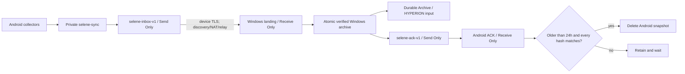

# SELENE One-Time Android / Windows Pairing

[English](P2P_SYNC.md) | [简体中文](P2P_SYNC.zh-CN.md)

SELENE 0.5.4 runs a Syncthing native core inside Android. Scan one short-lived
QR generated by SELENE Windows on a trusted LAN. Later synchronization can use
LAN, Internet direct connections, or Syncthing relays without shared Wi-Fi or a
self-hosted server. Updating the APK or replacing the Windows binaries preserves
both peers' identities and pairing.

## User Flow

### Windows

1. Open **Android one-time pairing** in SELENE Windows.
2. Confirm the sync landing directory. When Syncthing already has the
   SELENE-managed `selene-inbox-v1`, SELENE updates that folder to the selected
   path without changing its pairing or device membership.
3. Enable start-at-login so archiving and acknowledgements keep running.
4. Generate a one-time QR. This explicit action installs the official
   `Syncthing.Syncthing` winget package when needed.
5. Allow the temporary enrollment listener on Private networks only. It closes
   after five minutes.

### Android

1. Install SELENE 0.5.4 and grant only the collection permissions you use.
2. Put the phone and PC on one trusted LAN for initial enrollment.
3. Scan the QR or paste its `selene-pair:v1:...` text.
4. After both peers report success, they may leave that network. No later scan
   is required.
5. Restart HYPERION once after its first `HYPERION_SELENE_INBOX` setup. SELENE updates
   do not restart enrollment.

## Data Flow and Safe Deletion



Syncthing completion alone is not deletion authority. A deletion in Android's
Send Only folder still propagates to the Windows Receive Only landing folder,
which would otherwise remove the only PC copy. SELENE separates transfer from
durability:

- `selene-inbox-v1`: Android Send Only, Windows Receive Only; transient landing;
- Windows `Archive`: outside every Syncthing folder under current-user app data;
- `selene-ack-v1`: Windows Send Only, Android Receive Only; compact ACK JSON;
- `HYPERION_SELENE_INBOX`: points to durable Archive, never the transient landing.

Windows accepts only `SELENE-v1-<UTC timestamp>` directories. It parses
`context-events.json`, rejects bad schemas, temporary files, and path links,
hashes every file, copies into an archive-side temporary directory with durable
flushes, rechecks source and destination manifests, then publishes through an
atomic directory rename. An existing archive is idempotent only when its full
manifest matches. A conflict receives no ACK.

An ACK is compact JSON:

```json
{"schema":"selene-archive-ack/v1","snapshot":"SELENE-v1-20260807T120000000Z","contextSha256":"<64 hex>","byteCount":1234,"archivedAt":"2026-08-07T20:00:02+08:00","files":[{"path":"context-events.json","byteCount":1234,"sha256":"<64 hex>"}]}
```

Android housekeeping runs every 15 minutes and deletes only when all conditions
hold:

1. the UTC capture time in the directory name is at least 24 hours old;
2. a same-name ACK has the exact schema and snapshot name;
3. its file set exactly equals the phone directory's file set;
4. every relative path, byte count, SHA-256, total byte count, and context JSON
   hash matches.

Offline state, missing or malformed ACKs, hash differences, archive conflicts,
and snapshots younger than one day retain all phone files. After a validated
deletion propagates into the landing folder, the durable Windows Archive remains.

Windows 0.5.4 also rebuilds a derived daily combined JSON after each maintenance
pass. The files are under `%LOCALAPPDATA%\SELENE\Archive\Merged` and contain
the original Android and Windows event objects, deduplicated by stable event ID.
The immutable source snapshots and Windows exports remain untouched. A failed
source scan never replaces the last healthy daily file. See
[Daily Combined JSON](DAILY_MERGE.md) for the exact envelope and day rules.

## Enrollment and Automatic Migration

`selene-pair/v1` is more than a regular Syncthing device-ID QR:

1. Windows creates a 256-bit token, short-lived self-signed certificate,
   five-minute expiry, and private-LAN HTTPS endpoints.
2. The QR carries only the Windows device ID, primary folder ID, endpoints,
   token, expiry, certificate SHA-256, and display name. It excludes the GUI API
   key and source-machine paths.
3. Android validates fixed schema/folder values, device ID, expiry, private
   addresses, and the pinned certificate.
4. Android configures Windows plus `selene-inbox-v1` and `selene-ack-v1`, then
   returns its device ID over pinned HTTPS.
5. Windows constant-time checks the token, adds Android to both folders, and
   closes the listener.

Upgrading a 0.5.2 pairing needs no new scan. Android uses the saved Windows
device ID to idempotently add its Receive Only ACK folder. Windows reads the
existing data-folder members and shares its Send Only ACK folder with the same
devices. If only one peer has upgraded, cleanup waits; data is not deleted.

## Live Status

- Android refreshes every 10 seconds while its screen is visible: Windows
  online/offline, LAN versus remote/relay, data completion, data/ACK folder
  state, received ACK count, and total safely deleted snapshots.
- Windows refreshes every 10 seconds: connected versus paired Android count,
  LAN and remote route counts, acknowledged or pending archives, and the durable
  archive path.

"Remote sync 100%" describes transport progress only. A matching durable ACK is
the sole deletion authorization.

## Persistence and Updates

- Android pairing uses private SharedPreferences; Syncthing identity/config is
  under `noBackupFilesDir/syncthing`. Package replacement preserves both.
- Snapshots and ACKs use `filesDir/selene-sync` and
  `filesDir/selene-sync-acks`.
- Windows settings, Archive, and ACK roots derive from current-user system app
  data. Official Syncthing home is independent of SELENE binaries.
- Boot and package-replaced broadcasts restore paired sync, WorkManager, and
  permission-gated movement collection. Windows start-at-login restores
  archiving.
- Uninstalling Android removes app-private identity and requires enrollment
  again. An in-place update does not.

Android 8+ requires a visible notification for a persistent foreground service.
SELENE uses a silent low-importance channel but cannot bypass that platform
rule. Allow unrestricted battery and background data when OEM policy interferes.

## Troubleshooting

| Symptom | Resolution |
| --- | --- |
| Android reports Windows offline | Temporary shutdown is safe. For persistent failures, inspect discovery, NAT/relay, background data, and battery policy. |
| Windows shows paired devices but zero connected | Confirm the Android sync foreground service is running and both system clocks are sane; inspect Syncthing connection logs. |
| ACK count remains zero | Start 0.5.4 once on both peers. Verify `selene-ack-v1` is Send Only on Windows and Receive Only on Android. |
| Windows reports pending safe archive | Read the first displayed error. Check schema, temporary files, a conflicting same-name archive, and disk space. Android will retain data. |
| Phone retains data after one day | Confirm a matching ACK exists. Offline, mismatch, or actual age below 24 hours intentionally blocks cleanup. |
| HYPERION does not import | Restart HYPERION, verify `HYPERION_SELENE_INBOX` points to durable Archive, then inspect `/api/selene-sync/status`. |
| Update appears to require another QR | Do not disconnect or clear app data. Verify Android package ID and Windows user are unchanged. In-place updates migrate automatically. |
| Local API error mentions an Apache feature URI | Install 0.5.2 or later; Android's pull parser replaced the incompatible DOM feature. |
| Native core missing/not executable | The APK supports `arm64-v8a` and `armeabi-v7a`; install the complete unrepacked APK. |

## Development Verification

1. In-place update an existing 0.5.2 pairing on both peers and verify
   `selene-ack-v1` appears without a QR.
2. Exercise LAN direct and different-network/relay connections; both UIs should
   change within about ten seconds.
3. Create a snapshot offline, reconnect, and verify both durable Archive and ACK.
4. Use an older-than-24-hour test snapshot. After Android deletion, verify the
   Archive still exists and HYPERION can read it.
5. Remove an ACK, alter a hash, create a conflicting archive, and provide bad
   JSON; each case must retain Android data.
6. Verify the APK has only two ARM ABIs and QR/log output has no GUI API key or
   development-machine absolute path.
