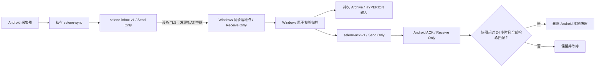

# SELENE Android / Windows 一次配对同步

[English](P2P_SYNC.md) | [简体中文](P2P_SYNC.zh-CN.md)

SELENE 0.5.4 在 Android 应用内运行 Syncthing 原生核心。首次在可信局域网扫描一次
Windows SELENE 生成的短期二维码后，后续同步可走局域网、互联网直连或 Syncthing
中继，不要求同一 Wi-Fi，也不需要自建服务器。覆盖安装 Android APK 或替换 Windows
程序不会改变双方的 Syncthing 身份和配对关系。

## 用户操作

### Windows

1. 打开 SELENE Windows 的“Android 一次配对同步”。
2. 确认同步落地点。若 Syncthing 已有 `selene-inbox-v1`，SELENE 会复用其实际路径。
3. 建议开启“登录 Windows 后启动 SELENE”，保证归档和 ACK 持续运行。
4. 点击“生成一次性配对二维码”。缺少 Syncthing 时，此明确操作会通过 winget 安装
   官方 `Syncthing.Syncthing`。
5. Windows 防火墙首次询问时只允许专用网络。enrollment 监听器五分钟后关闭。

### Android

1. 安装 SELENE 0.5.4，授予实际要使用的采集权限。
2. 首次配对时让手机与 Windows 暂时进入同一可信局域网。
3. 扫描 Windows 二维码，或手动粘贴 `selene-pair:v1:...` 配对码。
4. 两端显示成功后即可离开该网络。以后不再扫码。
5. 首次设置 `HYPERION_SELENE_INBOX` 后重启一次 HYPERION；后续 SELENE 更新不需要重启
   配对流程。

## 数据流与删除安全



不能依据“Syncthing 完成度 100%”直接删除手机文件：Send Only 端的删除仍会同步到
Windows Receive Only 落地点，从而把唯一 Windows 副本也删掉。SELENE 因此使用独立的
持久归档和反向确认：

- `selene-inbox-v1`：Android Send Only，Windows Receive Only，只是同步落地点；
- Windows `Archive`：位于 Windows 用户应用数据目录，不属于任何 Syncthing 文件夹；
- `selene-ack-v1`：Windows Send Only，Android Receive Only，只传很小的确认 JSON；
- `HYPERION_SELENE_INBOX` 指向持久归档，而不是会跟随手机删除的同步落地点。

Windows 只处理名称符合 `SELENE-v1-<UTC 时间戳>` 的目录。它解析
`context-events.json`、拒绝损坏 schema/临时文件/越界链接，为目录中每个文件计算
SHA-256，复制到归档临时目录并强制落盘，再次核对源和副本清单，最后用目录原子改名
发布。已有同名归档只有在完整清单一致时才视为幂等成功；冲突时不会发 ACK。

ACK 使用紧凑 JSON：

```json
{"schema":"selene-archive-ack/v1","snapshot":"SELENE-v1-20260807T120000000Z","contextSha256":"<64 hex>","byteCount":1234,"archivedAt":"2026-08-07T20:00:02+08:00","files":[{"path":"context-events.json","byteCount":1234,"sha256":"<64 hex>"}]}
```

Android 每 15 分钟执行一次清理。只有同时满足以下条件才删除整个快照目录：

1. 目录名中的 UTC 采集时间距当前时间至少 24 小时；
2. 存在同名 ACK，schema 和 snapshot 名完全正确；
3. ACK 的文件集合与手机目录完全相同；
4. 每个相对路径、字节数、SHA-256、总字节数和主 JSON 哈希都一致。

离线、ACK 缺失、JSON 损坏、哈希不符、Windows 归档冲突或目录仍不足一天时，Android
不会删除任何该快照文件。Android 删除后，同步落地点可以随之删除；Windows 持久
Archive 不受影响。

## 一次性配对与自动迁移

二维码使用 `selene-pair/v1`，不是普通 Syncthing 设备 ID：

1. Windows 创建 256 位随机令牌、短期自签名证书、五分钟过期时间和私网 HTTPS 端点。
2. 二维码只包含 Windows 设备 ID、主文件夹 ID、端点、令牌、过期时间、证书
   SHA-256 和机器显示名；不含 GUI API key 或本机源码路径。
3. Android 校验固定 schema/文件夹、设备 ID、过期时间、私网地址和证书指纹。
4. Android 配置 Windows、`selene-inbox-v1` 和 `selene-ack-v1`，再通过固定证书的
   HTTPS 回传手机设备 ID。
5. Windows 恒定时间比较令牌，加入 Android，并把 Android 同时共享到数据和 ACK
   文件夹，然后关闭监听器。

从 0.5.2 升级时无需重新扫码。Android 前台同步服务会用已保存的 Windows 设备 ID
幂等补建 ACK Receive Only 文件夹；Windows 启动时会读取主文件夹已有 Android 成员，
幂等补建 ACK Send Only 文件夹并共享给相同设备。任一端暂时未升级时只会延迟 ACK 和
自动清理，不会误删数据。

## 状态显示

- Android 设置页每 10 秒刷新：Windows 在线/离线、局域网或远程/中继、数据完成度、
  数据/ACK 文件夹状态、收到的 ACK 数量和累计安全清理数量。
- Windows 每 10 秒刷新：已连接/已配对 Android 数量、局域网或远程链路数量、本轮
  已确认快照、待归档错误和持久归档路径。

这里的“远程同步 100%”只说明 Syncthing 数据传输进度，不授权 Android 删除；删除
权限只来自匹配的持久归档 ACK。

## 持久化与更新

- Android 配对信息在私有 SharedPreferences，Syncthing 身份和配置在
  `noBackupFilesDir/syncthing`，两者都会保留于覆盖安装和 `MY_PACKAGE_REPLACED`。
- 手机快照和 ACK 分别在 `filesDir/selene-sync` 与 `filesDir/selene-sync-acks`。
- Windows SELENE 设置、归档和 ACK 根目录从当前用户系统应用数据目录动态派生；官方
  Syncthing home 独立于 SELENE 可执行文件。
- Android `BOOT_COMPLETED` 和应用升级完成后恢复已配对同步、WorkManager 和满足权限
  条件的移动服务；Windows 登录启动可恢复后台归档。
- 卸载 Android 应用会删除应用私有数据和设备身份，需要重新配对。覆盖安装不会。

Android 8+ 要求长期同步前台服务显示系统通知。SELENE 使用无声音、低重要性通知，
但不能规避系统要求；厂商省电策略仍可能中止后台网络，应允许 SELENE 后台运行。

## 按日合并 JSON

Windows `0.5.4` 每次维护同步后会在
`%LOCALAPPDATA%\\SELENE\\Archive\\Merged` 重建
`SELENE-merged-v1-YYYY-MM-DD.json`。它保留 Android 和 Windows 原始事件，按稳定事件
ID 去重；不可变原始快照和 Windows 导出目录不会被修改。来源扫描失败时上一份健康的
日文件保持不变。详细协议见 [DAILY_MERGE.zh-CN.md](DAILY_MERGE.zh-CN.md)。

## 排错

| 现象 | 处理 |
| --- | --- |
| Android 显示 Windows 离线 | Windows 可暂时关机；数据会保留。若长期离线，检查全局发现、NAT/中继、后台流量和省电策略。 |
| Windows 显示已配对但 0 台连接 | 确认手机同步前台服务在运行；两端系统时间正常；查看 Syncthing 连接日志。 |
| ACK 一直为 0 | 两端都升级到 0.5.4 并启动一次；确认 `selene-ack-v1` 在 Windows 为 Send Only、Android 为 Receive Only。 |
| “待安全归档” | 状态后会显示首个错误。检查 JSON schema、临时文件、同名归档冲突和磁盘空间；错误消失前手机不会清理。 |
| 手机一天后仍未清理 | 先看是否有匹配 ACK。离线、哈希不符或快照实际不足 24 小时都属于预期保留。 |
| HYPERION 没导入 | 重启 HYPERION，确认 `HYPERION_SELENE_INBOX` 指向 Windows 持久 Archive，再检查 `/api/selene-sync/status`。 |
| 覆盖更新后要求扫码 | 不要点“解除配对”或清除应用数据；确认 Android 包名和 Windows 用户未改变。普通覆盖更新应自动迁移。 |
| “本地接口未就绪”后跟 Apache feature URI | 安装 0.5.2 或更高版本；Android pull parser 已替代不兼容的 DOM feature。 |
| 核心文件缺失/不可执行 | APK 仅支持 `arm64-v8a`、`armeabi-v7a`；安装未经重新打包的完整 APK。 |

## 开发验证

1. 既有 0.5.2 配对双端覆盖升级，确认不扫码就出现 `selene-ack-v1`。
2. 分别验证局域网直连和不同网络/中继时，两端状态会在约 10 秒内变化。
3. 离线创建快照，恢复连接后确认 Windows Archive 与 ACK 都出现。
4. 把测试快照时间设为超过 24 小时，确认手机删除后 Windows Archive 仍存在且 HYPERION
   仍能读取。
5. 删除 ACK、篡改哈希、制造同名不同内容归档、使用损坏 JSON，确认手机始终保留。
6. 检查 APK 只有两个 ARM ABI，二维码和日志不包含 GUI API key 或开发机绝对路径。
